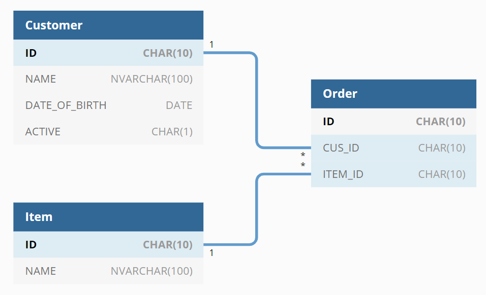

# dbdiagram2json
## Description
This tool is used for export .json file from [https://dbdiagram.io](https://dbdiagram.io/) diagrams 
## Usage

 1. Copy diagrams from [https://dbdiagram.io](https://dbdiagram.io/) to *dbdiagram.input* file place at the root of project.
 2.  Run command:
   > python main.py
 3. Output has been generated to *dbdiagram.json*
### Example
In file  **`dbdiagram.input`**:
```
Table Customer as cus {
  ID                CHAR(10)        [primary key, increment]
  NAME              NVARCHAR(100)   [not null]
  DATE_OF_BIRTH     DATE            [null]
  ACTIVE            CHAR(1)         [not null, default: "F"]
}

Table Order as ord {
    ID              CHAR(10)        [primary key]
    CUS_ID          CHAR(10)        [ref: > cus.ID, not null]
    ITEM_ID         CHAR(10)        [ref: > Item.ID, not null]
}

Table Item {
  ID                CHAR(10)        [primary key, increment]
  NAME              NVARCHAR(100)   [not null]
}
```


Will generate folowing **`dbdiagram.json`**:
```json
{
    "Table": [
        {
            "name": "Customer",
            "shortName": "cus",
            "option": null,
            "fields": [
                {
                    "name": "ID",
                    "type": "CHAR(10)",
                    "options": {
                        "primary key": true,
                        "increment": true
                    }
                },
                {
                    "name": "NAME",
                    "type": "NVARCHAR(100)",
                    "options": {
                        "nullable": false
                    }
                },
                {
                    "name": "DATE_OF_BIRTH",
                    "type": "DATE",
                    "options": {
                        "nullable": true
                    }
                },
                {
                    "name": "ACTIVE",
                    "type": "CHAR(1)",
                    "options": {
                        "nullable": false,
                        "default": "F"
                    }
                }
            ]
        },
        {
            "name": "Order",
            "shortName": "ord",
            "option": null,
            "fields": [
                {
                    "name": "ID",
                    "type": "CHAR(10)",
                    "options": {
                        "primary key": true
                    }
                },
                {
                    "name": "CUS_ID",
                    "type": "CHAR(10)",
                    "options": {
                        "ref": {
                            "op": ">",
                            "table": "cus",
                            "column": "ID"
                        },
                        "nullable": false
                    }
                },
                {
                    "name": "ITEM_ID",
                    "type": "CHAR(10)",
                    "options": {
                        "ref": {
                            "op": ">",
                            "table": "Item",
                            "column": "ID"
                        },
                        "nullable": false
                    }
                }
            ]
        },
        {
            "name": "Item",
            "shortName": null,
            "option": null,
            "fields": [
                {
                    "name": "ID",
                    "type": "CHAR(10)",
                    "options": {
                        "primary key": true,
                        "increment": true
                    }
                },
                {
                    "name": "NAME",
                    "type": "NVARCHAR(100)",
                    "options": {
                        "nullable": false
                    }
                }
            ]
        }
    ]
}
```